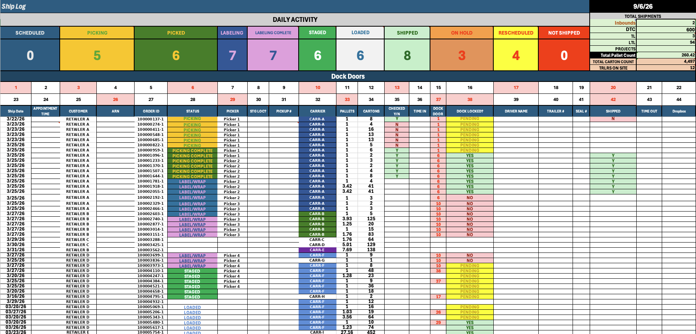

# Shipment Recovery Tracker — daily outbound control board

**Third-party logistics · Detect · Excel**

> A 44-door outbound operation was billing from memory. Shipments left the
> building, and some of them were never invoiced.
> The tracker made the gap visible on the day it happened instead of at month end.

---

## The site

A third-party logistics and distribution site in Los Angeles running outbound
for national retail and direct-to-consumer channels. Roughly 40 people on the
floor across picking, labelling, staging, and loading. 44 dock doors.

A representative day: 600 direct-to-consumer shipments, 94 less-than-truckload,
3 truckload, 4,497 cartons, 260 pallets, 12 trailers on site.

I was brought in on contract to implement cost-recovery systems, not to
supervise a steady state.

## The problem

Outbound status lived in three places at once — a WMS that knew what was
picked, a set of dock-side paper logs, and whoever happened to be standing at
the door. None of them agreed by end of shift.

The billing consequence is the part that matters. A shipment that left without
being reconciled against the outbound record was a shipment nobody invoiced.
It wasn't theft or gross negligence; it was a reconciliation gap wide enough
that nothing forced the question until the month closed and the number was
already wrong.

## What it isn't

This looks like a tracking problem and it isn't. Everyone on the floor knew
what was going out. The information existed, in people's heads and on paper,
in the fifteen minutes before a trailer pulled.

What didn't exist was a single place where a shipment's state was *unambiguous
to someone not standing at the door* — and, crucially, where an unresolved
shipment stayed visibly unresolved instead of quietly ageing out.

So the deliverable is not a report. It's a board the floor works *in*, where
the exceptions are the loudest thing on the screen.

## What I built

A single-screen daily control board covering the full outbound path.

**Status pipeline across the top.** Live counts for each stage: scheduled,
picking, picked, labelling, labelling complete, staged, loaded, shipped, on
hold, rescheduled, not shipped. A supervisor sees the shape of the day in one
glance without reading a single row.

**Dock door grid.** All 44 doors, occupied doors flagged. Door conflicts were
a recurring cause of trailers sitting, and they were previously discovered by
walking the dock.

**Per-shipment rows.** Ship date, customer, order ID, status, picker, carrier,
pallets, cartons, checked yes/no, dock door, dock locked, driver, trailer,
seal number, shipped, time out.

The two columns that did the actual recovery work are `CHECKED Y/N` and
`DOCK LOCKED?`. Together they encode the only question that matters at the
door: *has this been reconciled, and is it physically closed out?* A row that
is loaded but not checked is money leaving the building.

**Conditional formatting as the alerting layer.** Pending states hold yellow,
unresolved states hold red, and they stay that way. There is no dismiss
button. An exception that can be cleared by ignoring it will be.

## Results

- Roughly **$120,000 per month** in previously unbilled outbound identified and recovered.
- Adopted by a **40-person floor team** through design, rollout, training, and handover.
- Findings and recovery figures reported directly to site leadership.

Adoption was the deliverable. A tracker the floor works around recovers
nothing, so the board had to be faster to fill in than the paper it replaced —
which is why it stayed in Excel rather than becoming a database project.

## Why Excel

An honest note, since this is the least impressive-sounding tool in the
portfolio.

The constraint was a contract engagement with a defined end date, a floor team
with no appetite for new software, and existing site infrastructure I did not
control. A web app would have been a better artifact and a worse intervention.
Excel was already on every machine, already understood, and could ship in
days.

The judgement being demonstrated here is picking the tool that gets adopted
over the tool that looks good in a portfolio. The same instrumentation logic —
explicit state, exceptions that don't self-clear, one surface everyone reads —
is what I now build in Postgres and n8n when the engagement supports it.

## What's redacted

This is real operational data from a client site. Everything identifying has
been replaced programmatically, with consistent pseudonyms so the relational
structure still reads:

| Field | Treatment |
|---|---|
| Customer | `RETAILER A`–`E`, stable per customer |
| Order ID | Regenerated sequential IDs |
| Picker | `Picker 1`–`4`, stable per person |
| Carrier | `CARR-A`–`I`, stable per carrier |
| Driver name, trailer #, seal # | Empty in the source capture |

Volumes, pallet and carton counts, dock door numbers, statuses, and dates are
unmodified — they carry the operational picture and identify nobody.

## What I'd do differently

- **Status as a derived field, not a typed one.** It's hand-entered here, which
  means it can disagree with reality. Driving it from scan events would remove
  the failure mode entirely.
- **Timestamp the state transitions.** The board shows current state well and
  dwell time not at all. Time-in and time-out exist as columns but depend on
  someone filling them.
- **Push the exception list rather than waiting for someone to open the file.**
  The daily digest pattern I used later on other builds applies directly here.
